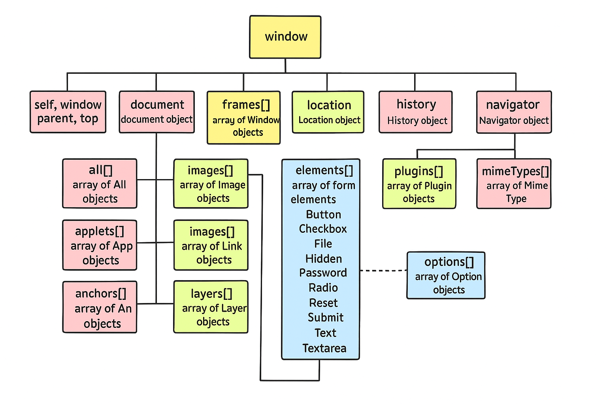

# [Intro lecture](https://github.com/alokg-812/Full-Stack-Development/blob/main/FashionStore/javascript/readme.md#java-story)


# [Day 1: Javascript PL vs SL](https://github.com/alokg-812/Full-Stack-Development/blob/main/FashionStore/javascript/readme.md#Day-1)
* [Javascript introduction](https://github.com/alokg-812/Full-Stack-Development/blob/main/FashionStore/javascript/readme.md#javascript)
* [Javscript as scripting Language](https://github.com/alokg-812/Full-Stack-Development/tree/main/FashionStore/javascript#--javascript-as-scripting-language)
* [Javascript as programming Language](https://github.com/alokg-812/Full-Stack-Development/tree/main/FashionStore/javascript#--javascript-as-programming-language)


# [Day 2: JS Client-side & DOM Hierarchy](https://github.com/alokg-812/Full-Stack-Development/blob/main/FashionStore/javascript/readme.md#day-2)
* [Client side of javascript](https://github.com/alokg-812/Full-Stack-Development/blob/main/FashionStore/javascript/readme.md#javascript-client-side-)
* [FAQs](https://github.com/alokg-812/Full-Stack-Development/tree/main/FashionStore/javascript#faqs)
* [Targetting HTML Elements](https://github.com/alokg-812/Full-Stack-Development/blob/main/FashionStore/javascript/readme.md#targetting-the-html-element-using-javascript)
  * [DOM Hierarchy](https://github.com/alokg-812/Full-Stack-Development/blob/main/FashionStore/javascript/readme.md#dom-hierarchy)
    * [Disadvantage of DOM Hierarchy](https://github.com/alokg-812/Full-Stack-Development/blob/main/FashionStore/javascript/readme.md#disadvantage)
  * [Targetting Selectors](https://github.com/alokg-812/Full-Stack-Development/blob/main/FashionStore/javascript/readme.md#targetting-through-selectors)

# [Day 3: ](https://github.com/alokg-812/Full-Stack-Development/tree/main/FashionStore/javascript#day-3)

# [Day 4: ](https://github.com/alokg-812/Full-Stack-Development/tree/main/FashionStore/javascript#day-4)

# [Day 5: ](https://github.com/alokg-812/Full-Stack-Development/tree/main/FashionStore/javascript#day-5)
# [Day 6: Var, Let & Const](https://github.com/Full-Stack-Development/tree/main/FashionStore/javascript#day-6--var-let--const)
* [var](https://github.com/Full-Stack-Development/tree/main/FashionStore/javascript#var)
* [let](https://github.com/Full-Stack-Development/tree/main/FashionStore/javascript#let)
* [const](https://github.com/Full-Stack-Development/tree/main/FashionStore/javascript#const)
* [differnce & common table](https://github.com/Full-Stack-Development/tree/main/FashionStore/javascript#difference--common-table)


# [Day 7: Variables & Datatypes](https://github.com/Full-Stack-Development/tree/main/FashionStore/javascript#day-7)
* [variables](https://github.com/Full-Stack-Development/tree/main/FashionStore/javascript#variables)
* [variable naming rules](https://github.com/Full-Stack-Development/tree/main/FashionStore/javascript#variable-naming-rules)


# [Day 8: Number, Conversion & Project](https://github.com/Full-Stack-Development/tree/main/FashionStore/javascript#day-7)
* [Javscript vs JSON](https://github.com/Full-Stack-Development/tree/main/FashionStore/javascript#javascript-vs-json)
* [Number](https://github.com/Full-Stack-Development/tree/main/FashionStore/javascript#number)
* [BigInteger](https://github.com/Full-Stack-Development/tree/main/FashionStore/javascript#biginteger)
* [isNaN vs Number.isNaN](https://github.com/Full-Stack-Development/tree/main/FashionStore/javascript#isnan-vs-numberisnan)
* [local-encode](https://github.com/Full-Stack-Development/tree/main/FashionStore/javascript#local-encode--currency)


# [Day 9: String in Javascript](https://github.com/Full-Stack-Development/tree/main/FashionStore/javascript#day-9-string-in-javascript-1)
* [Strings in Javascript](https://github.com/Full-Stack-Development/tree/main/FashionStore/javascript#day-9-string-in-javascript-1)
* [Working with ``(backticks)](https://github.com/Full-Stack-Development/tree/main/FashionStore/javascript#working-with-backticks)
* 


# [Day 10: More on Strings](https://github.com/Full-Stack-Development/blob/main/FashionStore/javascript/readme.md#day-10-more-on-binding--strings)
* [Binding](https://github.com/Full-Stack-Development/tree/main/FashionStore/javascript#binding)
* [String formatting methods](https://github.com/Full-Stack-Development/tree/main/FashionStore/javascript#string-formating-methods)
* [Common Javascript Errors](https://github.com/Full-Stack-Development/tree/main/FashionStore/javascript#common-javascript-errors)
* [Length Method](https://github.com/Full-Stack-Development/tree/main/FashionStore/javascript#methods-on-string-object)


# [Day 11: String methods](https://github.com/Full-Stack-Development/tree/main/FashionStore/javascript#day-11-string-methods-1)
* [Starts with endswith](https://github.com/Full-Stack-Development/tree/main/FashionStore/javascript#startswith--endswith)
* [CharCodeAt](https://github.com/Full-Stack-Development/tree/main/FashionStore/javascript#charcodeat)
* [Slicing](https://github.com/Full-Stack-Development/tree/main/FashionStore/javascript#syntax)
* [Substring](https://github.com/Full-Stack-Development/tree/main/FashionStore/javascript#substringstart-end)


# [Day 12: Splitting & Triming](https://github.com/Full-Stack-Development/blob/main/FashionStore/javascript/readme.md#day-12-spliting--trimming-method)
* [Methods of string object](https://github.com/Full-Stack-Development/blob/main/FashionStore/javascript/readme.md#methods-of-string-object)
* [Split Method](https://github.com/Full-Stack-Development/blob/main/FashionStore/javascript/readme.md#split-method-)
* [Trim Method](https://github.com/Full-Stack-Development/blob/main/FashionStore/javascript/readme.md#trim-method)


# [Day 13: Boolean](https://github.com/Full-Stack-Development/blob/main/FashionStore/javascript/readme.md#day-13-boolean--ternary)
* [Match Method](https://github.com/Full-Stack-Development/blob/main/FashionStore/javascript/readme.md#match-method)
* [Boolean](https://github.com/Full-Stack-Development/tree/main/FashionStore/javascript#boolean-type)
* [Ternary Operator](https://github.com/Full-Stack-Development/blob/main/FashionStore/javascript/readme.md#ternary-operator)


# [Day 14: Conditionals](https://github.com/Full-Stack-Development/blob/main/FashionStore/javascript/readme.md#day-14-conditional-statements)
* [Operators](https://github.com/Full-Stack-Development/blob/main/FashionStore/javascript/readme.md#operators)
* [Statments](https://github.com/Full-Stack-Development/blob/main/FashionStore/javascript/readme.md#statements)
* [Conditional Statments](https://github.com/Full-Stack-Development/blob/main/FashionStore/javascript/readme.md#conditional-statements)
     * [if](https://github.com/Full-Stack-Development/blob/main/FashionStore/javascript/readme.md#1syntax-of-if)
     * [else-if](https://github.com/Full-Stack-Development/blob/main/FashionStore/javascript/readme.md#2-syntax-of-if-else)
     * [nested-else-if](https://github.com/Full-Stack-Development/blob/main/FashionStore/javascript/readme.md#3-syntax-of-nested-if-else)
 
# [Day 15: Logical Operators](https://github.com/Full-Stack-Development/blob/main/FashionStore/javascript/readme.md#day-15)
* [Logical Operators](https://github.com/Full-Stack-Development/blob/main/FashionStore/javascript/readme.md#logical-operator)
* [Conditions with falsy cases](https://github.com/Full-Stack-Development/blob/main/FashionStore/javascript/readme.md#conditions-with-falsy-cases)
* [Conditions with truthy cases](https://github.com/Full-Stack-Development/blob/main/FashionStore/javascript/readme.md#condition-with-truthy-cases)
* [null vs undefined](https://github.com/Full-Stack-Development/blob/main/FashionStore/javascript/readme.md#difference-between-null-and-undefined)


# [Day 16: Switch](https://github.com/Full-Stack-Development/tree/main/FashionStore/javascript#day-16--switch)
* [Javascript Input Technique](https://github.com/Full-Stack-Development/tree/main/FashionStore/javascript#javascript-input-techniques)
* [Javascript Output Technique](https://github.com/Full-Stack-Development/tree/main/FashionStore/javascript#javascript-output-techniques)
* [Javascript Targetting Elements](https://github.com/Full-Stack-Development/tree/main/FashionStore/javascript#javascript-targeting-the-elements)
* [Switch in Javascript](https://github.com/Full-Stack-Development/tree/main/FashionStore/javascript#switch-in-javascript)
* [Case studies of switch](https://github.com/Full-Stack-Development/tree/main/FashionStore/javascript#case-studies)


# [Day17: arrays](https://github.com/Full-Stack-Development/blob/main/FashionStore/javascript/readme.md#day-17-non-primitive-types)
* [Arrays Introduction](https://github.com/Full-Stack-Development/blob/main/FashionStore/javascript/readme.md#array)
* [IIFE - Immediate Invoking Function Expression](https://github.com/Full-Stack-Development/blob/main/FashionStore/javascript/readme.md#iife-immediate-invoking-function-expression)
* [Key points for arrays](https://github.com/Full-Stack-Development/blob/main/FashionStore/javascript/readme.md#key-points-for-arrays)
* [Destructuring](https://github.com/Full-Stack-Development/blob/main/FashionStore/javascript/readme.md#destructuring)


# [Day18: array-methods](https://github.com/alokg-812/Full-Stack-Development/blob/main/FashionStore/javascript/readme.md#day-18)
* [Object Destructuring](https://github.com/alokg-812/Full-Stack-Development/blob/main/FashionStore/javascript/readme.md#object-destructuring)
* [Methods of array](https://github.com/alokg-812/Full-Stack-Development/blob/main/FashionStore/javascript/readme.md#reading-values-from-array--reading-array-elements)
* [Working with array-map](https://github.com/alokg-812/Full-Stack-Development/blob/main/FashionStore/javascript/readme.md#working-with-map)
* [For each loop](https://github.com/alokg-812/Full-Stack-Development/blob/main/FashionStore/javascript/readme.md#working-with-foreach)
* [Features of forEach](https://github.com/alokg-812/Full-Stack-Development/blob/main/FashionStore/javascript/readme.md#features-of-foreach)


# [Day19: array-methods-2](https://github.com/alokg-812/Full-Stack-Development/blob/main/FashionStore/javascript/readme.md#day-19)
* [Rest Operator](https://github.com/alokg-812/Full-Stack-Development/blob/main/FashionStore/javascript/readme.md#rest-operator-in-javascript)
* [Array Insertion](https://github.com/alokg-812/Full-Stack-Development/blob/main/FashionStore/javascript/readme.md#array-methods-for-inserting-the-elements)
* [Array-deletion](https://github.com/alokg-812/Full-Stack-Development/blob/main/FashionStore/javascript/readme.md#array-methods-for-deletion)
* [Inbuilt Array Sort](https://github.com/alokg-812/Full-Stack-Development/blob/main/FashionStore/javascript/readme.md#sorting-the-elements-in-an-array)
  

# [Day20: array-methods-3 | Object](https://github.com/alokg-812/Full-Stack-Development/blob/main/FashionStore/javascript/readme.md#day-20)
* 


# [Day21: ]()


# [Day22: ]()

# [Day23: ]()

# [Day24: ]()


# [Day25: ]()


---

## Java story:


## Observations in the image:
- `.class` is file outside the JDK.


**Compilation** - Process of converting HLL to MLL at once. <br>
Ques - I have a 10 line HLL code and have errors at line 4, 6, and 10. How many errors are generated by the compiler? <br>
Ans - `3 compile time error`


Scene - 10 HLL code -> 100 MLL code, 13th line error, 25th line error of MLL <br>
Ans - at 13th line, the `execution error` will be generated and no further execution will be done (Interpretation)

# Day 1
## JavaScript:

It was initially a scripting lang and not prog lang. <br>
Ques. What is difference between Programming Language & Scripting Language?
- `Programming Language`- A programming language is a formal language used to develop standalone applications, like operating systems, desktop apps, or games.
- Ex- C, C++, Java, etc...
- `Scripting Language`- A scripting language is generally used to automate tasks or extend the capabilities of existing programs.
- Ex- JavaScript, Python, etc...

| Feature               | Programming Language        | Scripting Language              |
|-----------------------|-----------------------------|---------------------------------|
| **Execution**         | Usually compiled            | Usually interpreted             |
| **Use**               | Build apps from scratch     | Automate tasks, enhance apps    |
| **Scope**             | System-level, standalone    | App-level, embedded             |
| **Performance**       | Generally faster             | Slightly slower (interpreted)   |
| **Examples**          | C, Java, Go                 | JavaScript, Python, Bash        |
| **Environment**       | OS or machine-level         | Inside applications (e.g., browser, shell) |

- In day to day life we use scripts like
    - for making folder, we use `GUI(Mouse right click-> create folder)` instead of `mkdir`. MKDIR is a script in our desktop
    - for date, we use `GUI`, instead of `date on command prompt`.
```yaml
C:\Users\alokg>date
The current date is: 24-04-2025

C:\Users\alokg>time 
The current time is:  9:19:21.76
```

- The adaptability of the Javascript lead to its nature as a programming language.

### - JavaScript as Scripting Language:


- The JIT compilation loads the code into the memory `Just In Time Compilation`
### - JavaScript as Programming Language:

- HLL is converted into bytecode internally even before the request has been shooted, if the bytecode starts after request shoot, time consumption happened.
- `Just Ahead of Time Compilation`, third party compiler is used to convert the code before the request shooting, here, we will use `Babel` for compilation.
- When request is shooted, only interpretation is done.


> JavaScript is `light weight interpreted` and `Just-in-Time Compiled` programming language.
> * Light weight refers to memory occupied and how heavy the application is.
> * Interpreted refers to line by line translation.


Compiled refers to translating entire program, all lines of program are translated simultaneously at the same time.
1. `JIT [Just-in-Time]` is the process where JavaScript is loaded into browser and compiled in browser. [This happens when the user sends the request]
2. `ADT [Ahead-of-Time]` is the process where JavaScript is compiled and processed at application level. [Even before the request comes this process would happen]


We can use various engines and compilers:
1. Ivy
2. Babel
3. Node
4. V8


JavaScript supports various programming techniques and approaches
* Structural Programming
* Functional Programming
* Imperative Programming
* Object Oriented Programming
> Note: JavaScript is not an OOP language, It supports only few features of OOP.

JavaScript is a programming language, which is used at different layers of our projects
1. Client Side: with HTML
2. Server Side: with Node 35
3. Database: MongoDB
4. Animation Tools: Flash, 3DS Max, etc..


Frontend => `React`[.js] <br>
Backend => `Node.js` | `Express.js`  <br>
Databse => `MongoDB`[.js] <br>

⁛ `MERN` = MongoDB + Express + React + Node.

FAQ1. What are the issues of Javascript? <br>
[Ans](https://github.com/Full-Stack-Development/tree/main/FashionStore/javascript/FAQs#faq1-what-are-the-issues-of-javascript) 
1. JavaScript is not `strongly typed`
(No data types enforced on a variable)

2. JavaScript is not `strictly typed`
(It allows using variables without declaring them)

3. JavaScript doesn't enforce `uniform data structure`
(Inconsistent data properties can exist together)

* JavaScript is not secured and it can be blocked by the browsers.

**Examples:**
- *Trojan*: Installing a virus via JavaScript can allow control of a device (Bad approach).
- *TeamViewer*: Installing remote access software properly can allow control of devices (Good approach).

# Day 2

JavaScript Client Side-
=================
1. The main purpose of JavaScript at Client side is to avoid `burden on the server`.

2. It can improve the performance of the application by managing the various interactions client side.

3. Interactions at the Client Side includes

	🚨 **a. DOM Manipulations**
		- Adding Elements into page
		- Remove Elements from Page
		- Update Data into Elements
		- Configuring styles to elements dynamically.
		- Configuring events to elements dynamically.

	🚨**b. It is used for validations**[Verify the user input]

	c. Client Side 
		- Managing Client Memory.[username and password stored in cache memory]
		- Managing Client Devices.[Booked the ticket and now print the ticket so we don't need internet].
		- Managing the locations of the user[websites ask for location].
		- Sharing of data with other applications on client device.


### How javasccript will take the control over html elements OR in how many ways we can write a javascript code in html page:


FAQ: 
 1.   What is the MIME type for script?	
Ans.
```javascript
	<script type='text/javascript'> :: bulk loading
	<script type='text/module'>     :: module based loading(performance is high)
```
**Explaination:**


 2.   What is difference between script in head and body?
Ans.
```javascript
     head ---> script would be loaded into browser memory and later used in the page
     body ---> script would be loaded directly into the page and it is not a part of browser memory.
```

 3.   How JavaScript converts Static DOM into Dynamic DOM?
Ans.
```javascript
          HTML -----> HTML parser ----> Static DOM
          CSS  -----> CSS  parser ----> use static DOM and change the style of an element using CSSOM.
	  JS   -----> Javascript engine -----> use STATIC DOM and converts into Dynamic DOM using 'events and functions'.
```

 4.   What is strict mode for JavaScript?
Ans.  without declaring a variable, if we dont' want javascript to permit the usage of variables then we need to go for `strictmode`
eg::
```javascript
    <script type="text/javascript>
		a = 10;
		console.log(a);
    </script>
```


```javascript
     <script type="text/javascript">
		"use strict";
		a = 10;
		console.log(a); //uncaught ReferenceError : a is not defined	
     </script>
```


 5.   How to target JavaScript for Legacy browsers? [Old Version Browsers]
Ans.  Developer can target new JavaScript code to the legacy browser by enclosing the code in `HTML comments`.

Syntax:
```javascript
<script type="text/javascirpt">
	<!--
		"use strict";
		......
		......
	-->
</script>
```

 6.   How to link external javascript file to html?
Ans.
```javascript
       <script src='(link to the javascript )'>
       </script>
```


### Targetting the HTML element using javascript:
* `DOM hierarchy`
* `Using ID`(limitation : multiple ids if used while targeting, we can access the first element)

```javascript
arrayElements.forEach(
	function(value, index, arr){
		console.log('Read the elements');
	}
)
```

## DOM Hierarchy

- With the HTML DOM, JavaScript can `access and change` all the elements of an HTML document.
- When a web page is loaded, the browser creates a Document Object Model of the page.

The HTML DOM model is constructed as a tree of Objects:


### Disadvantage:
1. If we target the element using DOM hierarchy, it might result in code break when DOM structure is `altered`.
> Solution: Use `ID` and target the element.

## Targetting Through Selectors

### Disadvantage:
1. if multiple `ids` are used, the first element with that ID would only be accessed.
   **eg#:**
   ```js
    <p id="heading">Hello User</p>
    <p>Welcome User</p>
    <script type="text/javascript">
        const pElement = document.getElementById("heading");
        pElement.style.cssText = "font-family: Brush Script MT; background-color: yellow; color: red;";
        console.log(pElement);
   ```
   _Output:_


#### Style Binding to HTML elements:
``element.style.properties = ""``
<br>OR<br>
``element.style.cssText = "cssKey: cssValue; cssKey: cssValue; cssKey: cssValue; ..."``

# Day 3
	


## Targetting Elements

### 1. `document.getElementsByClassName()  : HTMLCollection[]`

Ques. How to convert HTMLCollection to Array? <br>
Ans. `arrayElements = Array.from(HtmlCollection)`


### Working with iterator called `forEach` 
* It can be used only on Array object.

```javascript
callbackfunction = (value,index,arr) => {
		//value 
		//index
		//arr
};
forEach( callbackfunction)
```

### 2.  `document.getElementByTagName() : HTML Collection[]`
```
	Another approach to convert HTMLCollection to Array
		[...HTMLCollection]
```

3.
`document.getElementsByName : NodeList`
```
	While working with NodeList,directly we can use forEach() without any conversion.
```

4. Instead of remembering all these methods, we go for a method called 

`querySelector(cssSelector)` | `querySelectorAll(cssSelector)` to target the elements in a HTML Page.

		querySelector(cssSelector)    : Element
		querySelectorAll(cssSelector) : NodeList


FAQ:
a. why do we need so many methods to target HTML page using javascript ,when we can target directly with single method called `querySelectorXXX()`?

Ans. Older version of javascript added methods like

		getElementById(),
  		getElementsByClassName(),
    		getElementsByTagName(),
      		....
As css become popular, to give the direct support of accessing the elements using CSS, methods like querySelector() and querySelectorAll() were added.

	querySelector | querySelectorAll|getElementById ===> works only for static DOM
	  getElementsByClassName() 
	  getElementsByTagName()	====> Dynamic DOM
 	  getElementsByName() 


Accessing the elements using getElementsByTagName() : HTMLCollection(Live)
=========================================================================
```html
<!DOCTYPE html>
<html lang="en">
<head>
    <meta charset="UTF-8">
    <meta name="viewport" content="width=device-width, initial-scale=1.0">
    <title>Document</title>
</head>
<body>
    <h2>My Shopping List</h2>
    <ul id="shopping-list">
        <li>IPHONE</li>
        <li>ONEPLUS</li>
        <li>SAMSUNG</li>
    </ul>
    <button onclick="highlightItems()">Highlight Items</button>
</body>
</html>

<script type="text/javascript">
    function highlightItems(){
       let elements = document.getElementsByTagName("li")
       console.log(elements);

       console.log(elements);
       console.log(Array.from(elements))
       
       Array.from(elements).forEach((product,index,arr)=>{
            product.style.cssText = 'margin: 25px; color: green'
       })
    }
</script>
```


Difference b/w them with example
================================
<div id="main" class="box">
  <p class="box">Hello</p>
  <p class="box">World</p>
</div>


a. using id
const el = document.getElementById("main");
console.log(el); // <div id="main" class="box">

b. using classname
const boxes = document.getElementsByClassName("box");
console.log(boxes); // HTMLCollection(3) [div.box, p.box, p.box]

c. using querySelector()
const el = document.querySelector(".box");
console.log(el); // <div class="box">

d. using querySelectorAll()
const elList = document.querySelectorAll(".box");
console.log(elList); // NodeList(3) [div.box, p.box, p.box]

		refer chart to understand which one to use


Static vs. Dynamic DOM Access — What’s the difference?
======================================================

Static DOM Access
Happens once, at the time of accessing.

If DOM elements change later, the reference does not update.

Example: querySelectorAll() returns a NodeList, which is static.


Dynamic (Live) DOM Access
Reflects changes automatically.

If new elements are added or removed, the collection updates itself.

Example: getElementsByClassName() returns an HTMLCollection, which is live.


eg#1.
<div id="container">
  <p class="item">Item 1</p>
  <p class="item">Item 2</p>
</div>

<button onclick="addItem()">Add Item</button>

<script>
  const liveList = document.getElementsByClassName("item"); // Dynamic (live)
  const staticList = document.querySelectorAll(".item");    // Static (snapshot)

  function addItem() {
    const p = document.createElement("p");
    p.className = "item";
    p.textContent = "New Item";
    document.getElementById("container").appendChild(p);

    console.log("Live (HTMLCollection):", liveList.length);   // Updates
    console.log("Static (NodeList):", staticList.length);     // Does not update
  }
</script>


## Javascript output operations:
1. 'alert()'
2. confirm()
3. document.write() | document.writeln()
4. innerHTML | outerHTML
 e. innerText | outerText
 f. textContent
 g. console.XXXXX() [log(),warn(),error(),info(),debug()]


1. 
alert(msg) : void 
	It has a ok button
	It returns undefined when the user clicks ok button | presses esc keyboard
	It is used to just to display some messages.
		
Limitation
	a. No styling can be added to the Msg.
	b. No cancel button, so to come out of the actions the user should 		
		click 'esc' button.

2. 
  confirm(msg) : boolean
	It has ok and cancel button
	It returns true when user clicks on 'ok' button otherwise it returns false.

Limitation
	a. No styling can be added to the Msg.


# Day 4


# Day 5


# Day 6 : Var, Let & Const
### Var:
* It supports `hoisting` and `undefined` as the result.
* Redeclaring the same variable is possible.
* Reassignment of value to a variable is possible.
* It is `function scope variable`.
* It supports `shadowing`.

### Let:
* It supports `hoisting`(Variable would be in **Temporal Dead Zone** i.e., it cann't be used without initializing).
* If we try to use the variable present in the Temporal Dead Zone, then it would result in:
	``ReferenceError: variable can't be accessed without initialization.``
* Redeclaring same variable is not possible.
* Reassignment of value to a variable is possible.
* They are `block scope variable`(Can't be used outside the block).
* It supports `shadowing`.

### Const:
* It supports `hoisting`(Variable would be in **Temporal Dead Zone** i.e., it cann't be used without initializing).
* Redeclaring same variable is not possible.
* Reassignment of a value to the variable is also not possible.
* They are `block scoped variables`(Can't be used outside the block).
* It supports `shadowing`.

### Difference & Common Table

| Feature                | `var`                         | `let`                         | `const`                       |
|------------------------|-------------------------------|-------------------------------|-------------------------------|
| Scope                  | Function-scoped               | Block-scoped                  | Block-scoped                  |
| Hoisting               | Yes (initialized as `undefined`) | Yes (in Temporal Dead Zone)   | Yes (in Temporal Dead Zone)   |
| Can be reassigned      | Yes                           | Yes                           | No                            |
| Can be redeclared      | Yes                           | No                            | No                            |
| Temporal Dead Zone     | No                            | Yes                           | Yes                           |
| Use in loops           | Function-scoped               | Block-scoped (ideal for loops)| Block-scoped (not for reassignment) |
| Global Object property | Yes (if declared globally)    | No                            | No                            |


# Day 7:

## Variables:
It is the name given to memory location where we keep our data. Normally variables are used when we want to access the data in multiple lines.

#### Variable naming rules:

1.  Name must start with an alphabet or can start with `_` or `$`.

2. `_` is used for configures lot of constructs. `_` refers that variable requires further implementation.
```javascript
	var productName;  // its functionality is final
	var _productName; // Representation :: it is not yet implemented
```

3. Don't use special chars in variable.(Suggested by ECMA standards)

4. Name can be alpha numeric.
```javascript
	var product2020;
```

5. Name is case `sensitive`.

6. Name can be `max 255 chars` long.

7. Avoid using single char and long variable name.

8. Avoid using keywords[Total 45 reserved words]
	var const; // invalid
	var if;   // invalid

9. Always use camelCase for name and it should speak what it is?.
```javascript
	var u = "sachin"; //not a good approach
	var userName = "sachin"; //good approach
```

# Day 8:

### Javascript vs JSON:
**Javascript Object = {`key` : `value`}:**
- Convert javascript object to JSON -> `JSON.stringify()`.


**JSON Object = {`'key'` : `value`}:**
- Convert string representation(JSON) to javascript object -> `JSON.parse()`.


## Number:
> Javascript stores all numbers(whether typed by user or written in code) using **IEEE 754 double-precision floating point format(64-bit float)**.

| Bits    | Purpose                               |
|---------|---------------------------------------|
| 1 bit   | Sign (0 = positive, 1 = negative)     |
| 11 bits | Exponent (with bias of 1023)          |
| 52 bits | Mantissa/Fractional digits            |

| Concept            | Javascript (`number`) |
|--------------------|---------------------|
| Max safe integer   | 2⁵³ - 1             |
| Precision above limit | Lost              |
| Alternative        | BigInt              |

Since _numbers_ is _floating point type_, it leads to precision issues.
Ex: 
```javascript
	console.log(0.1+0.2); // 0.30000000002
```
**Solution:**
```javascript
	console.log((0.1+0.2).toFixed(2)); //0.30
```

## BigInteger:
> To store any large integer number(exceeding 53-bit precision), we use `BigInteger`.
```javascript
	let c = 9007199254740993n;
	console.log(c); //9007199254740993
	console.log(c == c+1n); //false[No loss of precision]
```

* To convert the data from String format to number type, we have `3 mechanisms`:
  1. `parseInt()` | `parseFloat()`
  2. `Number()`

1. `parseInt(input): number` <br>
	     
	    It also expects the input in string type,
   	    It returns the number till it encounter the special character
    	    If first symbol itself is a special charachter then it returns `NaN`

2. `Number(input): number` <br>

		It expects the data to strictly in number type only if any special symbols are part of the data then it would throw `NaN`.


### `isNaN()` vs `Number.isNaN()`

| Feature                        | `isNaN(input)`                                         | `Number.isNaN(input)`                                |
|-------------------------------|--------------------------------------------------------|-------------------------------------------------------|
| Type Conversion               | Converts input to `Number` before checking             | Does **not** convert the input                        |
| Checks                        | If converted result is `NaN` → returns `true`          | Checks if input is exactly `NaN`                      |
| Example: `isNaN("abc")`       | `true` (because `"abc"` → NaN)                         | `false` (because `"abc"` is not type `NaN`)           |
| Example: `isNaN(NaN)`         | `true`                                                 | `true`                                                |
| Example: `isNaN("123")`       | `false` (because `"123"` → 123)                        | `false`                                               |
| Example: `isNaN(undefined)`   | `true` (`undefined` → NaN)                             | `false` (not exactly `NaN`)                           |
| Example: `isNaN(true)`        | `false` (`true` → 1)                                   | `false`                                               |
| Example: `isNaN([])`          | `false` (`[]` → 0)                                     | `false`                                               |


```javascript
	let age = prompt("Please enter the age").trim();
	
	if (age == null) {
	  console.log("No age enetered, you pressed cancle or escape button");
	}
	else if (age == " " || isNaN(age)) {
	  console.log("Please enter the correct age")
	}
	else {
	  console.log("Age is : ", age);
	}
```

> [Note!]:
> While performing `+` operation, if one of the operand is `NaN` then the output would be `NaN`


### local-encode & currency:

| Country         | Locale Code | Currency Code |
|-----------------|-------------|----------------|
| United States   | "en-US"     | "USD"          |
| Germany         | "de-DE"     | "EUR"          |
| Japan           | "ja-JP"     | "JPY"          |
| India           | "en-IN"     | "INR"          |
| United Kingdom  | "en-GB"     | "GBP"          |

**Ex:**
```javascript

```

## Day 9, String in Javascript:
> String in javascript is created in 3 ways:
> 1. using ''. (`used internally by JS engine`)
> 2. using "". (`provided because other lang were using this`)
> 3. using ``. (`used by developers for Template Binding`)

Ex:
```javascript
let str1 = 'sachin'; //used internally by JS engine
let str2 = "kohli";
let str3 = `dhoni`; //used by developers for Template Binding
console.log(typeof str1, typeof str2, typeof str3);
console.log(str1, str2, str3);
```
Output:


```javascript
let str1 = 'sachin';
let str2 = new String("Dhoni"); // creating an object of String
console.log(str1.toUpperCase()); //helping developers to use mehtods on that object 

str1.country = "India"; //support not available because still str1:primitive type
console.log(str1);

str2.country = 'INDIA'; //as str2 is object, country as a key will be added
console.log(str2);
```

* Length Property:

Ex: 4:
```javascript
let str1 = 'sachin'; 
let str2 = new String('sachin');

console.log(str1);
console.log(str2);
console.log("Length of str1 is: ", str1);
console.log("Length of str2 is: ", str2);
```
Output:


### Working with backticks(`):
Ex 5:
```javascript
let userName = prompt("Enter the userName: ");
let userAge = prompt("Enter the userAge: ");
document.write('Hello ' + userName + ' Your age is: ' + userAge + '<br>\n');
document.write("Hello " + userName + " Your age is: " + userAge + '<br>\n');
document.write(`Hello ${userName} Your age is: ${userAge}` + '<br>\n'); //Expression Binding using template syntax
```


## Day 10: More on Binding & strings

### Binding:
Process of attaching a variable with its value at runtime is referred as Binding.

1. `DataBinding` : Binded the varibale with the value.
   **Syntax:** `${variableName}`
   ex:
   ``var userName = 'Sachin'
   document.write(`${userName}`);
   document.write(`${username}`);
   ``

2. `StyleBinding`: Process of attaching the style related details in `Inline` manner to an element is referred to as style binding.
   **Syntax:**
   `document.getElementById('').style.cssAttribute='cssValue`
   `document.getElementById('').style.cssText='cssKey: cssValue`

3. `ClassBinding`: Process of attaching the class assocuated with style to an elment is referred as class binding.
   **Syntax:**
   `document.getElementById('').classNmae = 'userDefined | Library class'`

Ques: What is an Event? <br>
Ans: Anything which happens on a webpage is event.

 	onclick  => When any element is clicked by the user[button]
  	onchange => When the value of an ekement is changed by the user.
   	onblur   => When the element looses focus.
    	onload   => When the page is loaded by the browser.


### String Formating Methods:
1. bold() :string
2. italics() :string
3. fontsize(number) : string
4. fontcolor(string) : string
5. toUpperCase() : string

eg#1: 
```javascript
let str = 'sachin';
let str1 = str.toUpperCase();
let str2 =  str1.bold();
let str3 = str2.fontcolor('red');
document.write(str3);
```
**OR**
``
document.write(str.toUpperCase().bold().fontcolor('red')); //method chaining
``

## Common JavaScript Errors

| Reference Error                          | Syntax Error                    | TypeError                                  |
|------------------------------------------|----------------------------------|--------------------------------------------|
| Variable is not defined                  | Variable is already declared     | Assignment to a constant variable          |
| Cannot access before initialization      | Invalid use of `let`/`const`     |                                            |
| Temporal Dead Zone (`let` / `const`)     |                                  |                                            |


### Methods on String Object:

1. `length`: It counts the number of characters present in the given string
   `length: number`

```javascript
let srt = 'sachin';
console.log(str.length); //6
console.log(str.length()); //typeError
```

## Day 11: String Methods

##### startsWith & endsWith
Two more methods on string:
1. `startsWith()`
2. `endsWith()`
   Ex:
   ```javascript
   let str = 'sachin@gmail.com';
   console.log(str.endsWith('@gmail.com')); //true
   console.log(str.startsWith('sachin'));   //false
   console.log(str.startsWith('SACHIN'));   //false
   ```

##### charCodeAt
`charCodeAt(Number)`: if number is of null| indefined | NaN, it would adjust to `0th index` data.


> 🌟 **Important**
> `Slice(starting, ending)`: It is used to extract the characters between specified index.
##### **Syntax:**
`slide(start, end): string` => it returns characaters between starting to ending(ending exclusive). <br>
Rule: 
* forward direction extraction.
* end index must be greater than starting index.

**Parameters:**
* startIndex(required):
  * the postition where extraction begins(inclusive)
  * if negative, it is trates as array.length + endIndex
* endIndex(optional):
  * the postion where extraction ends(exclusive)
  * if negative, it is trates as array.length + endIndex

**Key Points:**
- If startIndex is greater than endIndex, they are swapped.
- If startIndex or endIndex is negative or NaN, they are treated as 0.
- If endIndex is omitted, it extracts up to the end of the string.


> 💡 **Note**  
> - `slice(start, end)`:

 	a. NaN -> 0
  	b. null -> 0
   	c. undefined -> no parameter
    	d. true -> 1
     	e. false -> 0

**Ex:**
```javascript
let str = 'sachinrameshtendulkar'
console.log(str.slice(6, -5));                  //rameshtend
console.log(str.slice(6, 16));                  //rameshtend
console.log(str.slice(NaN, NaN));               //
console.log(str.slice(null, null)); 		//
console.log(str.slice(undefined, undefined));   //sachinrameshtendulkar
console.log(str.slice(true, true));		//
console.log(str.slice(false, true));		//s
console.log(str.slice(0, true));		//s
console.log(str.slice(false, null));		//
console.log(str.slice(false, undefined));	//sachinrameshtendulkar
```


##### `Substring(start, end)`
**Syntax:**
- substring(startIndex, endIndex) : string ==> endIndex can be -ve | +ve
- substring(startIndex) ==> It return from startindex to endindex-1

| Feature                                | `slice()`        | `substring()`                   |
|----------------------------------------|------------------|---------------------------------|
| Supports negative indices?             | ✅ Yes           | ❌ No (negative treated as `0`) |
| Swaps indices if `start > end`?        | ❌ No            | ✅ Yes                          |
| Takes `length` instead of `endIndex`?  | ❌ No            | ❌ No                           |
| Recommended for use?                   | ✅ Yes           | ✅ Yes                          |


## Day 12: Spliting & Trimming Method

##### Methods of string object:
1. `toUpperCase()`       : string
2. `toLowerCase()`       : string
3. `startesWith(string)` : boolean
4. `endsWith(string)`    : boolean
5. `charAt(number)`      : string
6. `charCodeAt(number)`  : number
7. `indexOf(string)`     : number(-1 if not found)
8. `slice([number],[number])` : string
9. `substring([number],[number])` : string
10. `trim()` : string
11. `split()` : string[] | null
12. `match()` : string


### Split Method : 
- It is used to split the given string based on the delimitor.
- It accepts two arguments:
   - `string   : delimitor`
   - `number   : limit`

**Syntax:** `split(string | regEx, number) : string[]`

eg#1:
```js
let names = "Sachin, Saurav, Dhoni, Yuvraj, Sehwag";
let output = names.split(',')
console.log(typeof output, output);        //object (5) ['Sachin', ' Saurav', ' Dhoni', ' Yuvraj', ' Sehwag']
```

eg#2:
```js
let names = "Sachin, Saurav, Dhoni, Yuvraj, Sehwag";
let output = names.split(',', 3)
console.log(typeof output, output);        // object (3) ['Sachin', ' Saurav', ' Dhoni']
```

eg#3:
```js
let str1 = 'hello user';                   
console.log(str1.split());                  //['hello user']
console.log(str1.split(''));                //['h, 'e', 'l', 'l', 'o', ' ', 'u', 's', 'e', 'r']
console.log(str1.split(undefined));	    //['hello user']
console.log(str1.split(null));		    //['hello user']
console.log(str1.split('', 0));             //[]
console.log('P,W,,'.split(','));            //['P', 'W', '', '']
console.log('P,W,'.split(','));             //[['P', 'W', '']]
```

### Trim Method:
- It is used to remove the leading and trailing spaces of the data. <br>

eg#1:
```js
let str='   sachin ramesh tendulkar  ';
console.log(str.length);    	 //28
console.log(str.trim());    	 //'sachin ramesh tendulkar'
console.log(str.trim().length);  //23
```


> ▶️ **Note:**
> * In javascript, we can use conditional statements on methods| properties which returns `object|null`.
> * This is possible because by default jacascript uses the following condition to process the instructions.
```js
if(someOutput != null){
	//truthy case
} else{
	//falsey case
}
```
**eg#1:**
```js
let str = ''.someMethod(input); //Object|null
if(str){ 						if(str != null){
	//process for true case
} else{					➡️➡️➡️➡️	}else{
	//process for false case
}							}
```

## Day 13: Boolean & Ternary

##### Match method():


### Boolean type
The permitted values are:
1. `true` | `fasle`
2. `>0` or `<0` : `true` :: `1`
3. `0` : `false` :: `0`

##### > FAQ: How boolean works with `+` as operators? <br>
> Ans:
> * if one operand is string type then perform `concatenation`. : `string`
> * if both operands are number tpe then it performs `addition`. : `number`
> * if onr operand is number and other operand is of other type like `boolean|null|undefined|`, it will convert to number type and then perform `Addition` : `number`

**eg#:**
```js
console.log(10+5);               // 15          (Number + Number)
console.log(3.5+2.5);            // 6           (Floating point addition)
console.log(-1+4);               // 3           (Negative + Positive)
console.log(2+"3");              // "23"        (Number + String => String concatenation)
console.log("2" + 3);            // "23"        (String + Number => String concatenation)
console.log("5" + true);         // "5true"     (String + Boolean => String concatenation)
console.log("5" + 10);           // "510"       (String + Number => String concatenation)
console.log(5 + "10");           // "510"       (Number + String => String concatenation)
console.log("Result: " + 5 + 10);// "Result: 510" (Left to right: "Result: " + 5 => "Result: 5", then + 10 => "Result: 510")
console.log(5+10 + " is the result"); // "15 is the result" (First 5+10 = 15, then + string => string concatenation)
console.log(true + null);        // 1           (true => 1, null => 0; 1+0 = 1)
console.log(undefined + null);   // NaN         (undefined => NaN, null => 0; NaN + 0 = NaN)
console.log(undefined + false);  // NaN         (undefined => NaN, false => 0; NaN + 0 = NaN)
console.log(undefined + NaN);    // NaN         (NaN + NaN = NaN)
console.log(NaN + NaN);          // NaN         (NaN + NaN = NaN)
console.log(NaN + null);         // NaN         (null => 0; NaN + 0 = NaN)
```


### Ternary Operator:

**Syntax:**
`condition` ? `if true` : `if false`

> FAQ: How to convert string 'true' to boolean true?
> Ans: 
```js
let boolType = 'true' === 'true' ? true : false;
console.log(boolType, typeof(boolType)); //true 'boolean'
```


> FAQ: What is the difference between `==` and `===`?


## Day 14: Conditional Statements


#### Operators:
1. Arithmetic Operator : `+`
    * all other arithmetic operators(`-`, `/`, `*`, `%`) are mainly meant to work with number type only.   
2. Comparision Operator : `==` | `===`
3. Ternary Operator : `condition ? true : false`

##### Statements-
- Executable code which would decide the control flow of the program.

#### Conditional Statements:
1. if
2. if-else
3. nested if-else
4. switch | case | default | break

#### 1.Syntax of if
```js
if(condition)
{
	//statement of true part
}
```
**condition :** `true` | `false` <br>
**eg#:**
[if-code.html](https://github.com/Full-Stack-Development/tree/main/FashionStore/javascript/day14_conditions) <br>


---

#### 2. Syntax of if-else
* It is a conditional statement where if block will be executed when condition matches for true otherwise else block will be executed.
* Else block is written without any condition, so by default if case fails then control would move to else block.
```js
  if(condition){
	//true
  }else{
	//false
  }
```
**eg#:**
[if-else.html](https://github.com/Full-Stack-Development/blob/main/FashionStore/javascript/day14_conditions/if-else-payment-card.html)


---

#### 3. Syntax of nested-if-else:
```js
if(condition1)
{
	if(condition2){
		if(condition3){
			//logic
		}else{
			//false logic of condition3
		}	
	}else{
		//false logic of condition2
	}
}else{
	//false logic of condition1
}
```

**eg#:**
[nested-if-else.html](https://github.com/Full-Stack-Development/blob/main/FashionStore/javascript/day14_conditions/nested-if-else-payment-card.html)


## Day 15:

#### Logical Operator
1. `&&`
2. `||`
3. `|`


### Conditions with falsy cases:
1. 0
2. ""
3. null
4. undefined
5. NaN
6. -0
7. 0n

### Condition with truthy cases:
1. any positive| negative number
2. " " | "sachin"
3. [] | P{
4. function(){}

### Difference between null and undefined?
**Ans:** 
`null`: runtime value. <br>
`undefined`: compile time value(used by js engine)

```js
if(NaN) console.log("Hi")
undefined
if("23") console.log("Hi")
VM557:1 Hi
undefined
if("") console.log("Hi")
undefined
if([]) console.log("Hi")
VM579:1 Hi
undefined
if(function(){}) console.log("Hi")
VM605:1 Hi
undefined
if(null) console.log("Hi")
undefined
if(undefined) console.log("Hi")
undefined
if(-8) console.log("Hi")
VM774:1 Hi
undefined


if(NaN) console.log("Hi")
undefined
if("23") console.log("Hi")
VM557:1 Hi
undefined
if("") console.log("Hi")
undefined
if([]) console.log("Hi")
VM579:1 Hi
undefined
if(function(){}) console.log("Hi")
VM605:1 Hi
undefined
if(null) console.log("Hi")
undefined
if(undefined) console.log("Hi")
undefined
if(-8) console.log("Hi")
VM774:1 Hi
undefined
console.log(1+undefined-'sachin'+null)
VM947:1 NaN
undefined
console.log(undefined-'sachin')
VM965:1 NaN
undefined
console.log(1+'sachin'+null)
VM976:1 1sachinnull
undefined
console.log(1+null)
VM990:1 1
undefined
console.log(true/false)
VM1089:1 Infinity
undefined
console.log(type of(true/false))
VM1164:1 Uncaught SyntaxError: missing ) after argument listUnderstand this error
console.log(typeof (true/false))
VM1179:1 number
undefined
2if-else-amazon-login.html:1 Uncaught (in promise) Error: A listener indicated an asynchronous response by returning true, but the message channel closed before a response was receivedUnderstand this error
console.log([] + [false])
VM1223:1 false
undefined
console.log([true] + [false])
VM1235:1 truefalse
undefined
console.log([] + [])
VM1248:1 
undefined
console.log([2,3] + [4,5])
VM1303:1 2,34,5
undefined
console.log([2,3] - [4,5])
VM1314:1 NaN
undefined
console.log("3"*"5"-4+null)
VM1381:1 11
undefined
if(NaN===NaN) console.log(true)
else{
    console.log(false)
}
VM1627:3 false
undefined
if(NaN==NaN) console.log(true)
else{
    console.log(false)
}
VM1634:3 false
undefined
if(NaN===NaN){
    console.log(true);
}
else{
    console.log(false)
}
VM1686:5 false
undefined
if(Infinity===Infinity){
    console.log(true);
}
else{
    console.log(false)
}
VM1708:2 true
undefined
if(NaN===undefined){
    console.log(true);
}
else{
    console.log(false)
}
VM1727:5 false
undefined
if(null == undefined){
    console.log(true);
}
else{
    console.log(false)
}
VM1752:2 true
undefined
if(null === undefined){
    console.log(true);
}
else{
    console.log(false)
}
VM1763:5 false
undefined

```

## Day 16 | Switch

### Javascript Input Techniques
1. `prompt()`: string| null
2. `queryString() | form elements`: string

### Javascript Output Techniques
1. `alert(string)` : (ok)
2. `confirm(string)` : (boolean)
3. `document.write(string|markup`
4. `innerHTML`
5. `textContent`
6. `outerText vs innerText`


### Javascript targeting the elements
1. `using id`: HTMLElements
2. `using name, classname, tagname`: HtmlCollection
3. `querySelector`: HtmlElement
4. `querySelectorAll`: NodeList


### Switch in Javascript:
- If we want certain set of statements to be executed, where the conidtion is already predefined then we need to go for `switch`.

**Ex:**
```js
let input = prompt("ENter the number b/w 1 to 4", "[1,2,3,4]");
switch (input){
    case '1': console.log("PBKS");                
	break;
    case '2': console.log("RCB");
	break;
    case '3': console.log("GT");
	break;
    case '4': console.log("MI");
	break;
    default: console.log("Better luck next time");
	break;
}
```
#### Case Studies:
> Note:
> 1. type will be comapred in `strict manner` with respect to label. <br>
>    `(type === label)` <br>
>    Ex: [example1](https://github.com/Full-Stack-Development/blob/main/FashionStore/javascript/day16_switch/example1.html) <br>
>    Ex: [example2](https://github.com/Full-Stack-Development/blob/main/FashionStore/javascript/day16_switch/example2.html)
> 2. `default` can be placed anywhere in the switch hierarchy.
> 3. default gets executed when none of the labels are matching with the input type.
> 4. while executing any label | default, if we don't attach break to that block, then `fall through` would happen.
> 5. for one input, if we want multiple cases to execute then we use the mechanism of fall through.
> 6. duplicate labels are allowed, the input matches with the first label matched.
> 7. default at max can only be one time in the switch statement.
> 8. switch argument type can be of any type like `boolean| string| number| object| function, ...`

---

# Day 17 Non Primitive Types

1. Mmeory would be allocated in `heap`.
2. Structure and range is `not defined`.
3. `Mutable`: changes made would be reflected in the same memory.
**Ex:** Aray, Map, Object, function(){}

---
### Array
- It is used to store multiple value under single variable.
- Memory allocation would be `continous` and data would be accessed via `index`.

**Creation Phase:**
- Java creation -> ``datatype variable[] = new datatype[size];``
- Javascript:
- -> ``let|var|const variable = new Array(size); //Dynamic array``
- -> ``let arr = [value1, value2, value3, ...]; //Static array``

**Ex:**
```js
let arr1 = [10, 'sachin', 53.4, true]; 
```
**Memory Allocation:** <br>


#### IIFE: Immediate Invoking Function Expression
```js
let arr = [10, 'sachin', 53.4, true, ['MI', 'IND'], function(){console.log("God of Cricket")}];
// console.log(arr); //[Function (anonymous)]
console.log(arr[5]); //God of Cricket
arr[5](); //IIFE Immediate Invoking Function Expression
```

#### Key points for arrays:
1. Inside an array, we can keep any type of elements [primitive and non primitive]
2. Indexing would happen internally in the form of `string` as the index would be `Key:value` pair data.
3. Arrays can be created in 2 ways:
	a. static <br>
   	b. dynamic <br>
4. Different ways of reading elements from an array:
   * using for loop
   * using property of the arra[key|index]
   * directly reading the value[element] from an array

i. `traditional for loop`
**Syntax:**
```js
for(initialization : condition : increament/decreament){
	arr[index];    //reading the elements using index	
}
```		
[for-loop-code](https://github.com/Full-Stack-Development/blob/main/FashionStore/javascript/day17_arrays/for-loop.html)

ii. `for...in loop`
**Syntax:**
```js
for(const property in object){
	arr[index];    //reading the elements using keys	
}
```
[for-in-loop-code](https://github.com/Full-Stack-Development/blob/main/FashionStore/javascript/day17_arrays/for-in-loop.html)

iii. `for...of loop`
**Syntax:**
```js
for(const element of object){
	console.log(element);    //reading the elements using index	
}
```
[for-of-loop-code](https://github.com/Full-Stack-Development/blob/main/FashionStore/javascript/day17_arrays/for-of-loop.html)

---

### Destructuring
=> `Destructuring` is a syntax that lets you unpack values form `arrays|objects` into individual variables in a clean and readable way. <br>
=> Readablity and it simplifies the code

**eg#1: Without Destructuring technique**
```js
	let arr = ['sachin', 51, 53.4, true];
	let userName = arr[0];
        let userAge = arr[1];
        let userAvg = arr[2];
        let isMarried = arr[3];
        console.log(userName, userAge, userAvg, isMarried);
```

**eg#2: Using array destructuring technique**
```js
	let arr = ['sachin', 51, 53.4, true];
        const[myName, myAge, myAvg, maritalStatus] = arr;
        console.log(myName, myAge, myAvg, maritalStatus);
```

**eg#3: Function returning an Array**
```js
	function presentData(){
            return ['kohli', 38, 47.4, true];
        }

	//destructuring the array to unpack the values
        const[name, age, avg, married] = presentData();
        console.log(name, age, avg, married);
```


**eg#4: With Object Destructuring**
```js
	let user={
            userName:"sachin",
            userAge:51,
            userAvg:54.4,
            userMail : 'sachin@ipl.com'
        };
        console.log("Using object destructuring");
        const{userName, userAge} = user;
        console.log(userName, userAge);
```


**eg#5: Using our own keys for Object Destructuring**
```js
	let user={
            userName:"sachin",
            userAge:51,
            userAvg:54.4,
            userMail : 'sachin@ipl.com'
        };

        console.log("Object destructuring using our own keys");
        const {userAvg:avg, userMail:mail} = user;
        console.log(avg, mail);
```


**eg#6: Object Destructuring but keu is not found while unpacking**
```js
	let user={
            userName:"sachin",
            userAge:51,
            userAvg:54.4,
            userMail : 'sachin@ipl.com'
        };
	console.log("Using object destructuring with unknown key");
        const{userName, salary='Not Disclosed'} = user;
        console.log(userName, salary);
```


# Day 18

### Object Destructuring
**-> syntax :**

		const{key1,key2,key3,...} = obj;
		const{key1:var1,key2:var2,..} = obj;
		const{key1 = 'value',key2,key3} = obj;

### Reading values from array | Reading array elements:
- `toString()` : It returns array elements seperated with ","
- `join()` : It returns array elements with custom delimitor
- `map()` : It returns array elements using iterator **(Best approach used in realtime coding)**
- `forEach()` : It returns array elements and their index references.
- `find()` : It returns the first occurance of the elements that matches condition
- `filter()` : It returns the elements that match specified condition
- `slice()` : It returns elements b/w specified index
- `unshift()`: It inserts element at front end.
- `shift()` : It deletes element at front end.
- `push()` : It inserts element at the end.
- `pop()` : It deletes element at the end.
- `splice()` : It inserts/deletes element at an specified position.
- `sort()` :
- `filter()`:
- `reduce()`: 

**eg#1.**
```js
<script type="text/javascript">
	let arr = [1,2,3];
	arr["2"] = 100;    // Number("2") : 2 ---> arr[2] = 100;
	console.log(arr);  // [1,2,100]
	console.log(arr.length);//3
	
	arr["sachin"]  = 10; //Number("sachin") : NaN ----> sachin:10
	console.log(arr);     // [1,2,100,sachin:10]
	console.log(arr.length);//3
</script>
```

**eg#2.**
```js
<script type="text/javascript">
       let arr = [1,2,3];
       for (const key in arr) {
            delete arr[key]; // it just deletes the value with key, not the memory of element
       }
       console.log(arr);//[empty * 3]
       console.log(arr.length); //3
</script>
```

### Working with map
In JavaScript, the `map()` is used on arrays to transform each element and `create a new array` based on the transformation.

* What map() Does?
  -  It does not change the original array.
  -  It returns a new array with the same number of elements.
  -  Each element is processed using a callback function you provide.

**Syntax**
```js
let newArray = array.map(function(element, index, array) {
  // return a new value for each element
});

array.map((element, index, array) => {       //arrow functions
  // return new value
});
```

eg#1: [map]()

### Working with forEach()
The `forEach()` in JavaScript is used to iterate over each element in an array and perform an operation, without returning a new array.
```js
Syntax: 
 array.forEach(function(element, index, array) {
  // do something with element
});

array.forEach((element, index, array) => {  // arrow functions
  // do something
});
```

### Features of forEach()
1. Executes a callback function once for each element in the array.
2. Does not return a value (i.e., it returns undefined).
3. Does not modify the original array unless you change elements explicitly.
4. Commonly used for side effects like logging, updating DOM, etc.

**eg#1:** <br>
[javascript code](https://github.com/alokg-812/Full-Stack-Development/blob/main/FashionStore/javascript/day18_more_on_arrays/forEach.js) <br>


# Day 19

## Rest Operator in javascript

**Ques** What is the Rest Operator (...)? <br>
**Ans.** 
- The rest operator is a syntax in JavaScript written as `three dots ...` used to collect multiple elements into a single array.
- It’s like saying: “Gather all the remaining elements into this variable.”

### Where to use rest operator???
| Usage Context		| Example		      |	What It Does                        |
| ======================| ============================|==================================== |
| Array Destructuring	| [a, b, ...rest] = [1,2,3,4] |	Gathers remaining elements as array |
| Object Destructuring	| {x, ...rest} = obj	      |	Gathers remaining props as object   |
| Function Parameters	| function fn(...args) {}     |	Collects all arguments into array   |


### Array methods for inserting the elements

**Syntax:** 
- `Array.push(...items)`   : number -> It would insert the element at the end of an array
- `Array.unshif(...items)` : number -> It would insert the element at the begining an array
- `Array.splice(start,deleteCount,...items)` : [deleted elements from an array]
   - if deleteCount = 0 , then elements in the array won't be deleted rather elements will be appended to the array.
   - deleteCount specifies the no of elements to be deleted while updating the elements in an Array

> ▶️ Note:
> `Array.concat(...items )` : [] [new array with modification]

### Array methods for deletion

- `Array.pop()` : string|undefined
- `Array.shift()` : string |undefined
- `Array.splice(start,deleteCount)` : [] : elements deleted will be returned in the form of an array
  


### Sorting the elements in an array
- `Arrays.sort(compareFunction)` : []
arrayName.sort([compareFunction])
1. Default sorting : string sorting[map with unicode value and performing sorting]
2. custom sorting  
**Rule :**
``
If result of (a - b) < 0 then a comes before b  
If result of (a - b) > 0 then b comes before a  
If result of (a - b) === 0 then keep original order
``


# Day 20

### filter()
- Returns a new array containing elements that passes through a test(i.e., return true) from a callback function.
- **Syntax:** `arrayName.filter(callback(element, index, array))`
  	- `callback:` function that tests each element.
  	- `element:` current element being processed.
  	- `index(optional):` index of the current element.
  	- `array (optional):` the array filter was called on.

#### Rules for writing arrow function:
1. Don't user function keyword while writing the arrow function.
2. If we have only one parameter then don't use () to specufy the parameter name.
3. If we have only statement as the function body then don't use {} to define the body.
4. If the function returns a value, then explicitly `return` keyword to tell return(only with one statement).

**eg#1: basic example**<br>
[code]() <br>


**eg#2: age example**<br>
[code]() <br>


**eg#3: cart example**<br>
[code]() <br>


### reduce method
> Reduces the array to a single value by applying a function to each element and acculating the result.
> **Syntax:** `array.reduce(callback(accumulator, currentValue, index, array), initialValue);`
- `accumulator`: accumulated the result.
- `currentValue`: current element being processed.
- `initialValue`: optional value to start the accumulation.


## Object
> **Object** -> `Properties(data)` | `methods(logic)`
> **JSON** -> `properties(data)`
> **Syntax:**
```js
{
	key : value
}
```
* `key` should be of string type
* `value` can be of any type(string | number | boolean | object)

**eg#1:**<br>
[code]() <br><br>


## JSON
**Definition:** _If object contains only `has-part` then in javascript, we say such objects as `JSON`._
> **JSON** -> `properties(data)`
> **Syntax:**
```js
{
	"key" : value[number|bbolean|array|string|object|function] 
}
```

* **Syntax to read JSON data:**
    * `product.key | product['key']` ===> `.` is referred as member invoking operator.

#### When to use `obj.key` operator and when to use `obj['key']`???
 1. using obj[key]
- If the key is a variable or a computed value.
- If the key is a not valid identifier _OR_ key is part of another variable.
  ``
  const weirdObj = {'firstName': 'sachin', '123': 'number};
  console.log(weirdObj['firstName'])
  console.log(weirdObj['123'])
  ``
 
 2. using obj.key
- You know the key ahead of time and it is a valid identifier.

# Day 21 Advanced Javascript

## Quick visit of Non Primitive types
1. Array	: 
    ```
    Heterogenous elements it can hold
    static array : let arr = [];
    dynamic array : let arr = new Array(size);
      K,V
      K : string , V : any type[number,string,boolean,function,array,object]
      Iteration : forloop, for...in [key], for...of[value]
      Property : length
      Methods  : map(),reduce(),filter()
          forEach() : logging, dom manipulation

          Insertion: unshift() | push()| splice(start,deleteCount,...items)
          Deletion : shift()   | pop() 
          Sorting  : sort[compareFunction]
          Reverse  : reverse()
      ```
Destructuring : Array, Object
Rest Operator : Array, Object, Function parameter
		```	    
   b. Object
	 has part  : property
	 does part : methods
	 JSON  : {
			"K" : value[any type]
		 }

     Access part 
          a. "." operator when identifier is valid and if the key is already known.
	        b. ['key'] when the key is not a valid identifier and the key is part of another variable.
    ```

## Execution Flow of javascript code by the engine
- Javascript is a `Single Threaded Synchronous` programming language.
    - `Synchronous` : JS engine can't move to next line until it executes the current line code [`Blocking mode`]
    - `Single Threaded` : Single line of execution [main thread].


### Promise
**Promise:** We asked for something, it can be


# Day 22
> ▶️ Note:
> By default, All the web APIs or browser APIs javascript engine can use with the help of `Window Object`

### Browser APIs:
1. `setTimeout(callback, timer)`
2. `fetch(URL)`
   ```js
   .then(function(success){

     })
   .catch(function(error){

     })
   ```
   
1. Promise: It is an async operation code which would run with the help of browser internal components.
   * `Event Loop`: checks whether the callstack is empty or not, if empty load the callback function into callstack for execution
   * `MicroTask Queue`: a priority queue where the data is associated with (.then() and .catch()) will be loaded.
   * [Syntax code]()

```js
let promiseOutput = new Promise(function(resolve, reject){
		// api code
		if(condition){
			resolve();
		} else{
			reject();
		}
});

promiseOuput
.then(function(){
	//resolve output;
})
.catch(function(error){
	//reject output;
});
```

2. async/await:

# Day 24

[!image](../public/images/flipkartImage.png)

## Asynchronous nature of Object:

# Day 25 Map, Date, & Functions

### Limitations of Object:
- Key must be of `string` type.
- No standard API of its own to tell `length` of the object.
  - (Alternate way: obj.keys() will return array of keys and then arr.length).
- `Searching` and `deletion` on its own can't be done, it should be with the help of Operators.
- Best suited only when the data is `structured`, otherwise it would fail.

> 💡 `Map` comes up with the solution for the limitations of object.
> **Syntax:** `` var name = new Map();``
> Methods of Map: Map provides following methods for manipulation.

| Method      | Description                                             |
|-------------|---------------------------------------------------------|
| `set()`     | Assigns a new key with a value.                         |
| `get()`     | Accesses a value using the reference of a key.          |
| `keys()`    | Returns all the keys.                                   |
| `values()`  | Returns all the values.                                 |
| `entries()` | Returns all keys and their corresponding values.        |
| `delete()`  | Removes a key and its corresponding value.              |
| `has()`     | Checks if a key exists in the map.                      |
| `clear()`   | Removes all keys and values from the map.               |
| `size`      | Returns the total number of keys present.               |


> ▶️ Note: we use `for...of` to iterate if we have data in Map type.

# Symbol type in Javscript
- It is a primitve datatype of Javascript,
- It is used for unique identification of any elemnt in Object.
- It configures hidden key, whixh is individually used but ignored over iterations.

> Configure a symbol: ``var ID = Symbol()``
> Define key with Sumbol type in Object: `{[ID] : value}`
> Access the key individually: `Object[ID]`

### Key Points:
1. We can create a `Symbol()` type with the same key.
2. Even if we create a Symbol() typw with the same key, still `2 different objects` would be available in the memory.
3. If we use `==` or `===` on Symbol() with same key, the result would be `false`.
4. We can use `toString()` on Symbol() to convert into String type while rendering on UI.

## Working with Date type

### JavaScript Date Object Methods

| Method             | Description                                                                       |
|--------------------|-----------------------------------------------------------------------------------|
| `getHours()`       | Returns the hour number(0 to 23).                                                 |
| `getMinutes()`     | Returns the minutes number(0 to 59).                                              |
| `getSeconds()`     | Returns the seconds number(0 to 59).                                              |
| `getMilliseconds()`| Returns the milliseconds number(0 to 999).                                        |
| `getDay()`         | Returns the day number of the week (0 = Sunday, 1 = Monday, ..., 6 = Saturday).   |
| `getDate()`        | Returns the date number of the month (1 to 28/29/30/31 depending on the month).   |
| `getMonth()`       | Returns the month number(0 = January, 1 = February, ..., 11 = December).          |
| `getFullYear()`    | Returns the 4-digit year.                                                         |
| `getYear()`        | *Obsolete.* Returns the year minus 1900 (e.g., 123 for 2023).                     |


# Day 26 Functions
1. Function Declaration | Function Statement
2. Function Expression
3. Arrow Function
4. Anonumous Function
5. CallBack Function [Synch | Asynch : Promise, Asynch, Await]
6. Higher Order Function

# Day 27 Exception Hadling
## Exception
- **Exceptions** are runtime mistakes which happens due to faulty inputs given by the user to the application. Because of faulty input, the application would result in `Abnormal termination`.
- To resolve the problem of Abnormal terminatione, we use `Exception handling Mechanism`
- Exceptoin handling will promote `Graceful terminatoin of a program`
- [It would not affect OS | hardware device of the user.]
- Syntax:
  ```
  try{
	//risky code
  }
  error(catch(error)){
	//handling code
  }
  finally{
	//resource releasing code 
  }
  ```

# Day 28 EH2

### Details in error Object


| **Property** | **Description**                   |
| ------------ | --------------------------------- |
| `name`       | Type of error (e.g., `TypeError`) |
| `message`    | Description of the error          |
| `stack`      | Stack trace (few info)            |

### Checked vs Unchecked Exceptions

- All exceptions in javascript are `unchecked exceptions`
- _These exceptions are not checked by compiler during memory allocation phase._


### Rest Operator
This operator is used to bind multiple values under single variable. <br>
**syntax:**
```js
function collectData(...variable){

}
collectData(10, 'js', 53.5, true);

```

### Spread Operator
This operator is used to spread multiple values. <br>
**syntax:**
```js
function collectData(...data){

}
collectData(...sendData)
```


# Day 29


### Shallow Copy:
> Shallow copy copies the top-level properties of an object only. If the obkect has nested objects or arrays, the references to those nested structures are copied.

### Deep Copy:
> A deep copy creates a completely independent clone of the object, including all nested objects and arrays. No shared references. <br>
> It is done using `structuredClone(object)`.<br>

### Rest Operator
1. Every function must have only one rest paramete,
2. 


### Syntax:
```js
function* generatorFunction(){
	yield value1;
	yield value2;
	...
}
```
function* - declares a generator.
yield - pauses the functions and returns a value.
.next() - resumes the function and gives the next value.

## Higher Order Functions

# Day 30 Operators in Javascript
1. Unary Operator: Single Operand [++, --, !=]
2. Binary Operator: Two Operands [+, -, *, /, ==, ]
3. Ternary Operator


